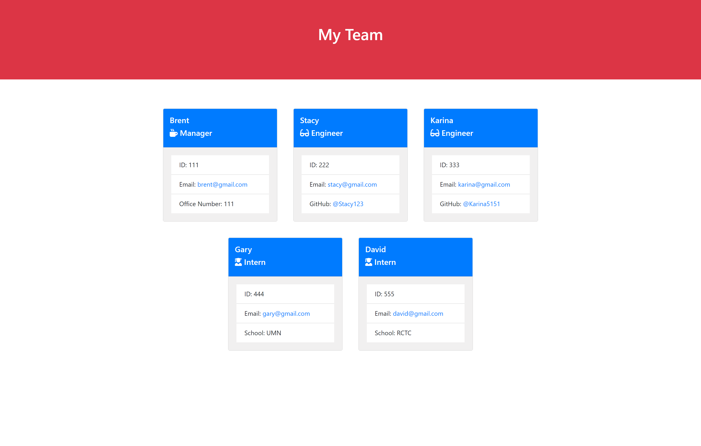
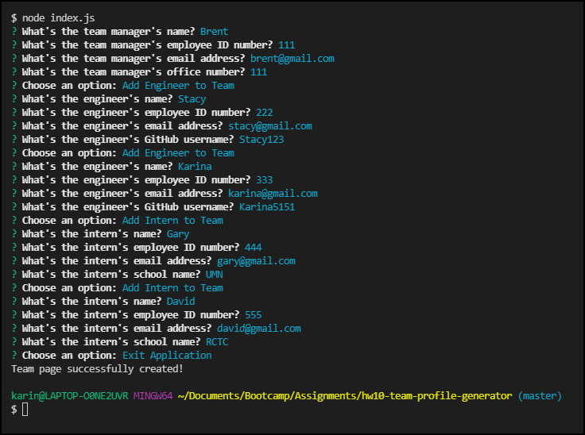
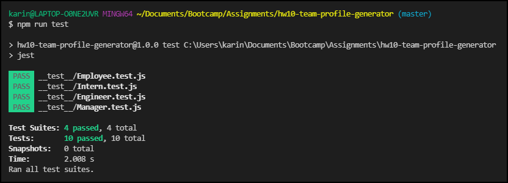

# Team Profile Generator

 &nbsp;&nbsp;&nbsp;&nbsp; &nbsp;&nbsp;&nbsp;&nbsp; &nbsp;&nbsp;&nbsp;&nbsp;


## :memo: Description
  This is a Node.js command-line application that receives information about employees on a software engineering team, to then generate an HTML webpage displaying the profiles of each employee.

Launch example webpage [here](https://karina5151.github.io/hw10-team-profile-generator/dist/index.html)



## :trophy: Table of Contents
* [Installation](#installation)
* [Usage](#usage)
* [Contributing](#contributing)
* [Tests](#tests)
  
  
## Installation
* Fork the https://github.com/Karina5151/hw10-team-profile-generator repo.
* Clone your forked repo to VS Code your computer.
* Open index.js in your terminal.
* Install the node dependencies by entering in the terminal:
```
npm i
```

## Usage
To generate a webpage for your software engineering team by completing all prompts in the terminal upon running:
```
node index.js
```


<a href="https://drive.google.com/file/d/1TeUPNBs9ZwsuvNa1-06g1Ui8VptV33zY/view?usp=sharing" rel="nofollow" target="_blank">Click here for the full screen demo</a>


## Contributing
This application was developed by Karina Clausen.
The technologies that made this possible are:
* HTML
* CSS
* JavaScript
* <a href="https://nodejs.org/api/fs.html" rel="nofollow" target="_blank">Node.js</a>
* <a href="https://www.npmjs.com/package/jest" rel="nofollow" target="_blank">Jest</a>
* <a href="https://www.npmjs.com/package/inquirer" rel="nofollow" target="_blank">Inquirer</a>
* <a href="https://shields.io/" rel="nofollow" target="_blank">Shields.io</a>
* <a href="https://getbootstrap.com/" rel="nofollow" target="_blank">Bootstrap</a>
* <a href="https://fontawesome.com/" rel="nofollow" target="_blank">Font Awesome</a>


## Tests
```
npm run test
```



 ---

 ## :question: Questions

For any questions, please contact me using the information below:

:octocat: GitHub: [@Karina5151](https://github.com/Karina5151)

:envelope: Email: karina.clausen.11@gmail.com
